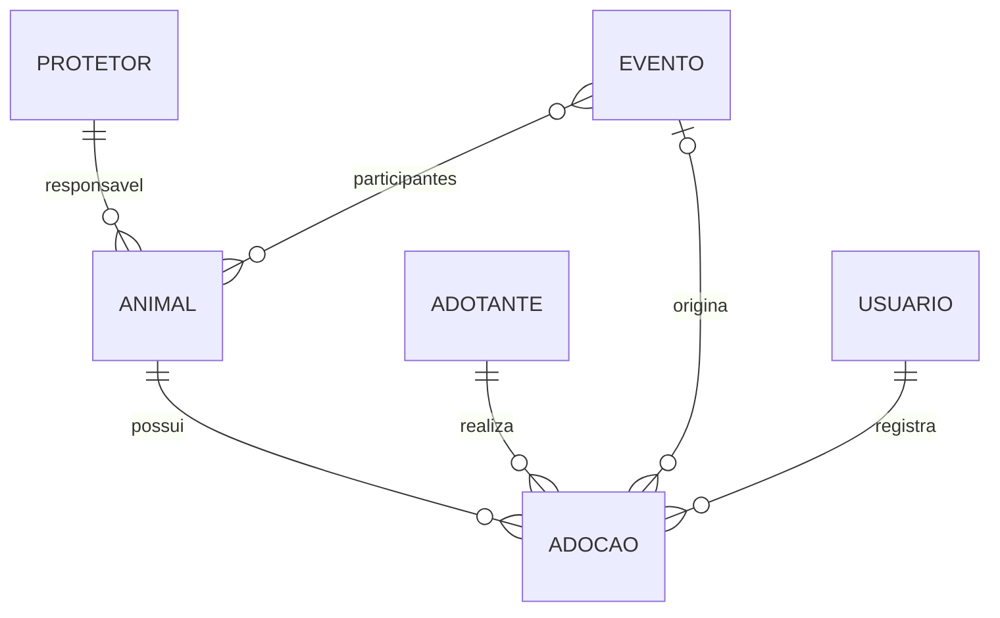

# Decisões de domínio

Este documento registra as decisões tomadas durante a descoberta do projeto. Ele evita que regras importantes fiquem apenas na memória ou sejam alteradas sem discussão.

## 2026-08-22 — Escopo do MVP

O sistema será uma aplicação web de uso interno da ONG Guardiões da Causa Animal. O MVP contempla os módulos Animais, Protetores, Adoções, Eventos, Doações e Parceiros, além do cadastro de Adotantes necessário às adoções.

Ficam fora do MVP: portal público, autoatendimento de adotantes, pagamentos, notificações, integrações com redes sociais, aplicativo móvel e relatórios avançados.

## 2026-08-22 — Capacidade do protetor

A capacidade máxima representa quantos animais estão sob os cuidados atuais do protetor.

Contam para a capacidade:

- animal em acompanhamento;
- animal disponível para adoção;
- animal em processo de adoção, enquanto permanece sob a responsabilidade do protetor.

Não contam:

- animal adotado;
- animal transferido para outro responsável;
- animal falecido;
- animal devolvido à ONG ou retirado da responsabilidade do protetor.

A aplicação deverá impedir, no servidor, que uma operação deixe um protetor acima de sua capacidade. A regra detalhada será implementada com testes na fase de modelagem.

## 2026-08-22 — Dados pessoais

O CPF é obrigatório para Protetores e Adotantes. Como se trata de dado pessoal, ele será coletado apenas para o uso administrativo previsto, validado no servidor e jamais utilizado em dados de demonstração.

## 2026-08-22 — Adoções associadas a eventos

Uma adoção pode não ter evento. Quando tiver, o animal adotado deve estar entre os participantes daquele evento. A validação será feita no servidor e protegida pelo fluxo transacional da adoção.

## 2026-08-22 — Inativação de protetores

Protetores com histórico não serão apagados: serão inativados. Isso preserva rastreabilidade quando a pessoa deixa de atuar, é suspensa ou está temporariamente indisponível.

Um protetor inativo não poderá receber novos animais. Antes da inativação, o sistema deverá verificar e orientar sobre animais ainda sob sua responsabilidade.

## Decisões pendentes

- Definir os status exatos e as transições de Animais e Adoções.
- Definir os papéis de acesso além de administrador.
- Definir política de inativação/exclusão para os demais módulos.
- Definir formatos e limites de upload para fotos, logos e termos.
- Confirmar os campos mínimos de endereço e contato.

## Diagrama inicial

